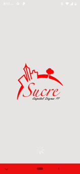
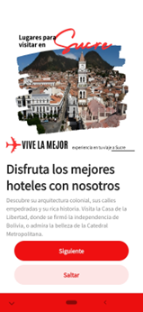
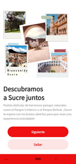
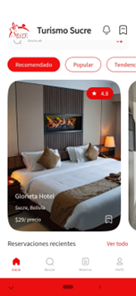
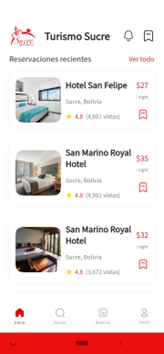
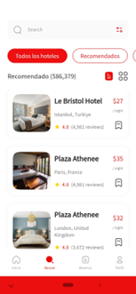
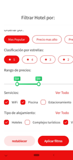
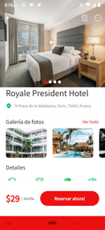
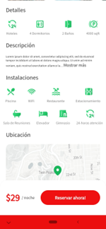
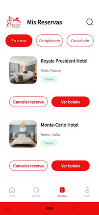

# Sistema de Reservación de Hoteles - Sucre

Aplicación móvil multiplataforma para la **reservación de hoteles, hostales y alojamientos** en la ciudad de Sucre, Bolivia. El sistema permite a los usuarios explorar opciones de hospedaje, ver detalles completos, filtrar por preferencias y realizar reservaciones de manera sencilla.

## Contexto

La ciudad de Sucre, capital constitucional de Bolivia y Patrimonio de la Humanidad, recibe miles de turistas cada año. Sin embargo, encontrar y reservar alojamiento puede ser un proceso fragmentado y poco intuitivo.

Este sistema busca centralizar la oferta hotelera de la ciudad en una aplicación móvil moderna, ofreciendo una experiencia de usuario fluida desde la exploración hasta la reservación. **Actualmente el proyecto se enfoca en interfaces de usuario estáticas** con integración básica al backend para mostrar datos, con planes de integración completa en futuras versiones.

## ¿Qué resuelve?

* Centraliza la información de hoteles, hostales y alojamientos de Sucre en un solo lugar.
* Facilita la búsqueda y comparación de opciones de hospedaje.
* Permite ver detalles completos: fotos, ubicación, precios y descripciones.
* Ofrece un sistema de filtrado para encontrar el alojamiento ideal.
* Gestiona reservaciones de manera intuitiva.
* Proporciona autenticación segura para usuarios.

## Estado actual del proyecto

| Componente | Estado |
| --- | --- |
| **Interfaces de usuario** | ✅ Completas y funcionales |
| **Pantallas de presentación** | ✅ Implementadas |
| **Visualización de hoteles** | ✅ Conectado al backend |
| **Sistema de filtrado** | ✅ Implementado (UI) |
| **Reservaciones** | 🔄 Interfaz lista, integración pendiente |
| **Autenticación** | ✅ Login y registro funcionales |
| **Backend completo** | 🔜 Planificado para futuras versiones |

## ¿Qué se puede hacer en el sistema?

* **Explorar hoteles**: Navegar por la lista completa de alojamientos disponibles en Sucre.
* **Ver detalles**: Información completa de cada hotel incluyendo múltiples imágenes, ubicación, precio y descripción.
* **Filtrar opciones**: Buscar hoteles según preferencias específicas.
* **Realizar reservaciones**: Seleccionar fechas y confirmar reservaciones (interfaz).
* **Gestionar perfil**: Ver y administrar información del usuario.
* **Ver mis reservaciones**: Consultar el historial de reservaciones realizadas.
* **Autenticación**: Registro de nuevos usuarios e inicio de sesión seguro.

## Capturas de pantalla

### Pantallas de Presentación (Splash Screen)

| | | |
|:---:|:---:|:---:|
|  |  |  |
|  |  | |

### Autenticación

| Inicio de Sesión | Registro |
|:---:|:---:|
|  |  |

### Pantalla Principal

| Home 1 | Home 2 |
|:---:|:---:|
|  |  |

### Lista y Filtrado de Hoteles

| Lista de Hoteles | Filtro |
|:---:|:---:|
|  |  |

### Detalle del Hotel

| Detalle 1 | Detalle 2 |
|:---:|:---:|
|  |  |

### Reservaciones y Perfil

| Reservación | Mis Reservaciones | Perfil |
|:---:|:---:|:---:|
|  |  |  |

## Tecnologías

### Frontend (Aplicación Móvil)
* **Framework:** Flutter 3.x (Dart)
* **Gestión de estado:** GetX
* **UI Components:** Google Fonts, Flutter SVG, Card Swiper
* **Mapas:** Google Maps Flutter
* **Selectores de fecha:** Syncfusion Flutter Datepicker
* **HTTP Client:** http package
* **Notificaciones:** Flutter EasyLoading

### Backend (API REST)
* **Framework:** Flask (Python)
* **Base de datos:** MySQL
* **Autenticación:** bcrypt para hash de contraseñas
* **Servidor de archivos estáticos:** Flask static

## Instalación y ejecución

### Backend

1. Crear y activar entorno virtual:

```bash
cd BACKEND
python -m venv venv
# Windows
venv\Scripts\activate
# Linux/macOS
source venv/bin/activate
```

2. Instalar dependencias:

```bash
pip install flask flask-mysqldb bcrypt
```

3. Configurar la base de datos MySQL:

```bash
# Importar el esquema de base de datos
mysql -u root -p < bd_hoteles.sql
```

4. Insertar datos de prueba:

```bash
python insertar_datos.py
```

5. Iniciar el servidor:

```bash
python app.py
```

El servidor estará disponible en `http://localhost:5001`

### Frontend (Flutter)

1. Navegar al directorio del proyecto:

```bash
cd FRONTEND/Sucre-Hotel
```

2. Instalar dependencias:

```bash
flutter pub get
```

3. Ejecutar la aplicación:

```bash
# Android
flutter run

# iOS
flutter run -d ios

# Web
flutter run -d chrome
```

## Requisitos (para desarrollo)

### Backend
* Python 3.8+
* MySQL Server
* pip

### Frontend
* Flutter SDK 3.x
* Dart SDK >=2.18.4 <4.0.0
* Android Studio / Xcode (para emuladores)
* VS Code o Android Studio (IDE recomendado)

## Estructura del proyecto

```
├── BACKEND/
│   ├── app.py                 # API REST principal
│   ├── bd_hoteles.sql         # Esquema de base de datos
│   ├── insertar_datos.py      # Script para datos de prueba
│   ├── static/                # Imágenes de hoteles
│   └── file/                  # Archivos adicionales
│
├── FRONTEND/Sucre-Hotel/
│   ├── lib/
│   │   ├── main.dart          # Punto de entrada
│   │   ├── config/            # Configuraciones (estilos, imágenes)
│   │   ├── controller/        # Controladores GetX
│   │   ├── model/             # Modelos de datos
│   │   ├── service/           # Servicios HTTP
│   │   ├── view/              # Vistas/Pantallas
│   │   │   ├── auth/          # Login, Registro
│   │   │   ├── home/          # Pantalla principal
│   │   │   ├── splash/        # Pantallas de presentación
│   │   │   ├── search/        # Búsqueda y filtros
│   │   │   ├── profile/       # Perfil de usuario
│   │   │   └── document/      # Detalles y reservaciones
│   │   ├── widget/            # Widgets reutilizables
│   │   └── utils/             # Utilidades
│   └── assets/                # Recursos estáticos
│
└── docs/
    └── imgs/                  # Capturas de pantalla
```

## API Endpoints

| Método | Endpoint | Descripción |
| --- | --- | --- |
| GET | `/hoteles` | Obtener lista de todos los hoteles |
| POST | `/register` | Registrar nuevo usuario |
| POST | `/login` | Iniciar sesión |

## Integraciones Futuras

- [ ] Sistema completo de reservaciones con confirmación
- [ ] Pasarela de pagos
- [ ] Sistema de calificaciones y reseñas
- [ ] Notificaciones push
- [ ] Chat con hoteles
- [ ] Sistema de recomendaciones basado en preferencias
- [ ] Integración con mapas para navegación
- [ ] Favoritos y lista de deseos
- [ ] Historial de búsquedas
- [ ] Ofertas y promociones

## Notas

Proyecto académico en desarrollo. Sistema diseñado inicialmente como "Sistema de Recomendación de Hoteles" que evolucionará hacia un **Sistema Completo de Reservaciones** para la ciudad de Sucre, Bolivia.

## Autor

Rodrigo Rosario Cruz